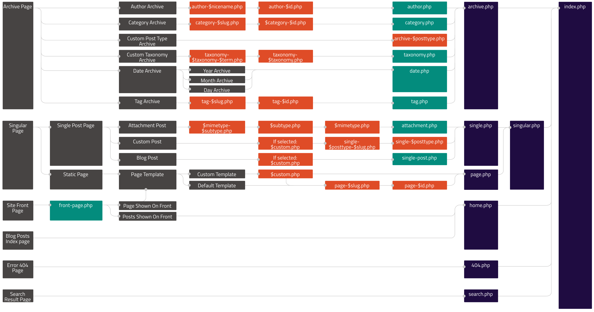

# Wordpress Themes

## Setup

Most of the setup is already covered with the docker-compose file. Nonethless,
you have to create a database using phpMyAdmin which with docker-compose runs
on port 8000. After that just go through the installation instructions and you
are done.

## Structure

Wordpress provides many built in function which we should use to structure our
HTML content:

- get_header(): import the wordpress and user defined header HTML
- get_footer(): import the wordpress and user defined footer HTML
- language_attributes(): the blogs language in the wordpress configuration
- bloginfo('keyword'): return the information set in the configuration

Wordpress processes views from specifc files to more generic ones. This can be
visualized in the diagram below.

Wordpress allows us to define functions for our teams and will load by default
a file called `functions.php` if it exists. We can create it and define all our
functions in there or elsewhere and include them there once.

## Validation, Sanitization and Escaping

Wordpress has severla built function to validate, sanitize and escape user input
input. This is important because data could be corrupt, inject malicious scripts
or just not diplay the content the user intended:

1. [Validation Docs](https://developer.wordpress.org/themes/theme-security/data-validation/)
2. [Sanitization Docs](https://developer.wordpress.org/themes/theme-security/data-sanitization-escaping/)
